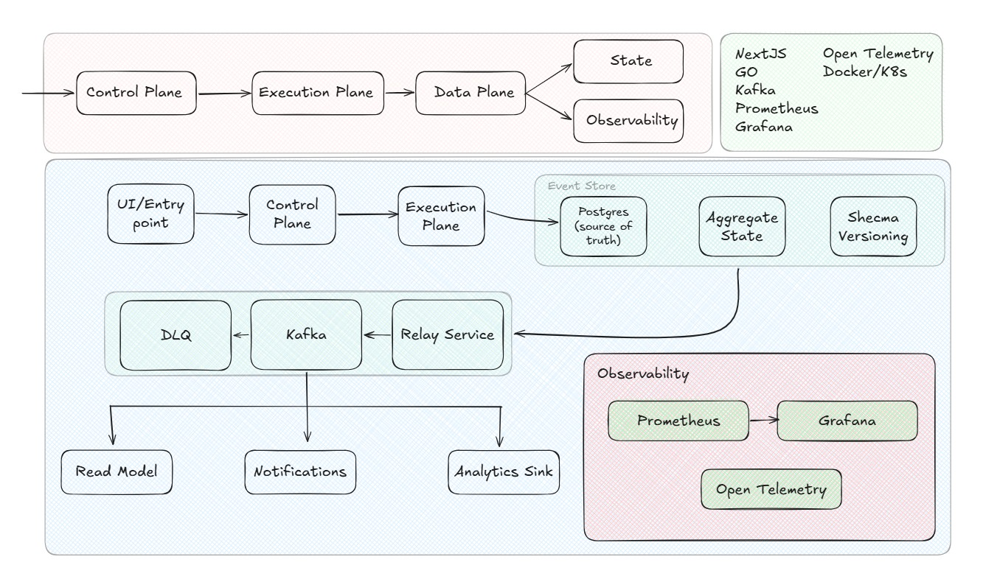

# FluxCDC

### Database-Agnostic Change Data Capture Platform

> A configurable, event-driven CDC platform designed to capture, transform, route, and replay database changes across heterogeneous systems.

---

## Overview

FluxCDC is a database-agnostic Change Data Capture (CDC) platform built for flexibility, extensibility, and operational visibility.

Unlike traditional CDC systems that rely on tightly coupled integrations, FluxCDC separates **control**, **execution**, **data movement**, **state management**, and **observability** into independent planes.

The system is designed to:

* Operate independently from application systems
* Support multiple databases through pluggable connectors
* Stream changes to configurable destinations
* Enable replay, recovery, and schema evolution
* Scale from local development to distributed deployments

The architecture intentionally avoids dependency on existing CDC frameworks and instead exposes an extensible runtime for future connector development.

---

# Features

### Database-Agnostic Capture

Support generic and database-specific capture modes.

Examples:

* Polling
* Transaction logs
* Snapshot ingestion
* Trigger-based capture

---

### Connector Architecture

Build connectors independently of the core platform.

Supported connector types:

* Source Connectors
* Sink Connectors
* Transform Connectors

---

### Event-Driven Processing

Every captured change becomes an immutable event.

Supports:

* Replay
* Recovery
* Fan-out
* Auditing

---

### Schema Evolution

Track schema changes alongside event streams.

Capabilities:

* Version tracking
* Migration awareness
* Historical reconstruction

---

### Replay Engine

Reprocess historical data without re-reading the source database.

Use cases:

* Recovery
* Debugging
* Backfills
* Rebuilding projections

---

### Observability First

Built-in support for:

* Metrics
* Distributed tracing
* Dashboards
* Event visibility

---

# Architecture



---

# Core Concepts

## Control Plane

Responsible for deciding **what should run**.

Responsibilities:

* Connector lifecycle
* Pipeline configuration
* Scheduling
* Policy management

---

## Execution Plane

Responsible for deciding **how work executes**.

Responsibilities:

* Connector execution
* Replay jobs
* Transform execution
* Routing orchestration

---

## Data Plane

Responsible for moving data.

Responsibilities:

* Event transport
* Queueing
* Retry handling
* Delivery guarantees

---

## State Plane

Responsible for durable recovery.

Responsibilities:

* Event persistence
* Offsets
* Schema versions
* Aggregate materialization

---

## Observability Plane

Responsible for system visibility.

Responsibilities:

* Metrics
* Traces
* Alerting
* Diagnostics

---

# Capture Modes

## Poll Mode

Universal mode.

Requirements:

* Primary key
* Watermark column

Example:

```
updated_at > checkpoint
```

---

## Log Mode

Database-specific mode.

Examples:

* PostgreSQL WAL
* MySQL Binlog
* SQL Server CDC

---

## Snapshot Mode

Full table capture.

Useful for:

* Bootstrap
* Recovery
* Backfills

---

# Event Model

```json
{
  "event_id": "...",
  "connector": "...",
  "database": "...",
  "table": "...",
  "operation": "UPDATE",
  "before": {},
  "after": {},
  "schema_version": 12,
  "timestamp": ""
}
```

---

# Tech Stack

| Layer           | Technology          |
| --------------- | ------------------- |
| Backend         | Go                  |
| UI              | Next.js             |
| Event Streaming | Kafka               |
| Metadata Store  | PostgreSQL          |
| Metrics         | Prometheus          |
| Dashboards      | Grafana             |
| Tracing         | OpenTelemetry       |
| Deployment      | Docker / Kubernetes |

---
# Roadmap

## Phase 1

* Generic polling connector
* Event persistence
* Kafka integration

## Phase 2

* Replay engine
* Schema registry
* DLQ support

## Phase 3

* PostgreSQL log connector
* Connector SDK

## Phase 4

* Transform runtime
* Pipeline visualization

## Phase 5

* Multi-region deployment

---

# Design Goals

* Database independence
* Extensibility
* Reliability
* Operational simplicity
* Replayability
* Observability

---

# License

MIT License
